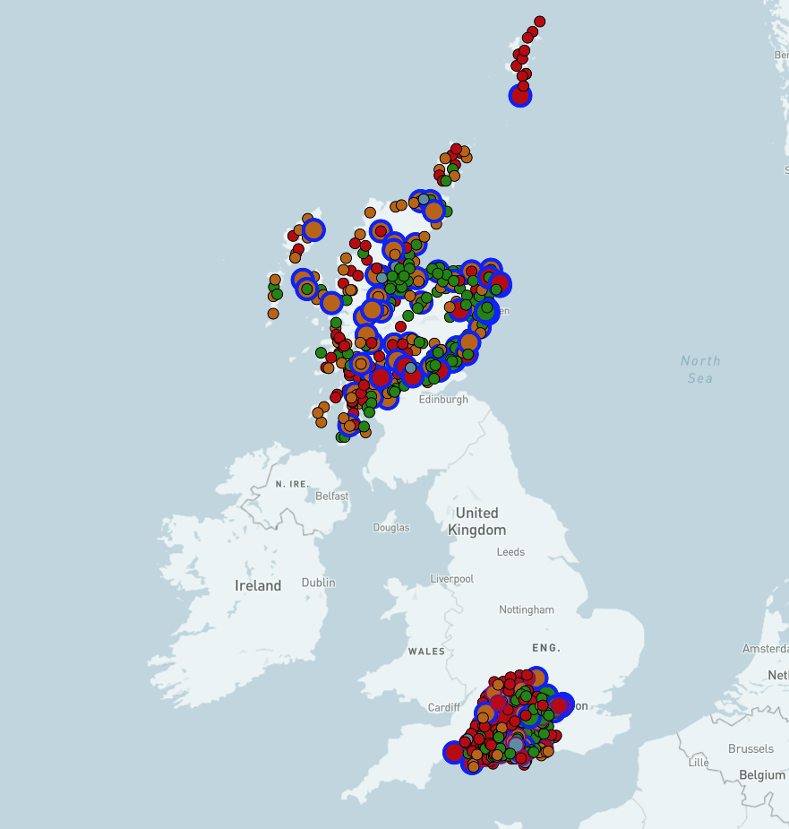

# Network Heatmaps Example

This is a working example of the proposed heatmap data standard for network operators being developed by [Ofgem](https://www.ofgem.gov.uk/) under the [LTDS](https://www.ofgem.gov.uk/publications/next-steps-our-reforms-long-term-development-statement-ltds-and-key-enablers-dso-programme-work) reforms.

## Mapbox Rendering of JSON data

[Visit Heatmap Example](./map)

### Heatmap Data Format

This example uses [JSON](https://www.json.org/) serialisation of the data taken from the [Network Heatmaps API](https://github.com/opengridsystems/network-heatmaps-api) repository, with the [Sample JSON data](https://github.com/opengridsystems/network-heatmaps-api/blob/main/sample-data/sample-data.json) used directly, converted into [GeoJSON](https://geojson.org) with a small Javascript function, then used with [Mapbox GL](https://docs.mapbox.com/mapbox-gl-js/api/) layers to render Substation locations and two example circuits.

### Data Source

The data set used is derived from public [network demand & generation capacity](https://network-maps.ssen.co.uk/) data supplied by [SSEN](https://www.ssen.co.uk/).

The data set used in this example is **not** current, and reflects a historical set.  It also contains two example circuits in the Perth area that are included for illustration purposes.

### Map Rendering

The icons on the map are coloured based on the Red, Amber, Green (RAG) status of the substation based on its **generation capacity**.  The circuits are coloured based on their **load capacity**. Hovering the mouse over the icon will display all the _populated_ properties of the data set.  The properties are all defined in the [heatmap data definition documentation](https://github.com/opengridsystems/network-heatmaps-api/tree/main/documentation).

### Source Code

The source code for parsing and displaying the data can be found in the [GitHub repository](https://github.com/opengridsystems/network-heatmaps-example). The Javascript used is embedded within the [index.html](https://github.com/opengridsystems/network-heatmaps-example/blob/main/map/index.html) HTML file.

## Alternative Format

The same data can be viewed as an [Excel](https://github.com/opengridsystems/network-heatmaps-api/blob/main/sample-data/sample-data.xlsx) file. 

## Development & Licensing

This code was developed by [Open Grid Systems Ltd](https://www.opengrid.com) in its role as delivery partner to Ofgem for this process.  All code is made available under the open source [Apache 2.0](https://www.apache.org/licenses/LICENSE-2.0)
